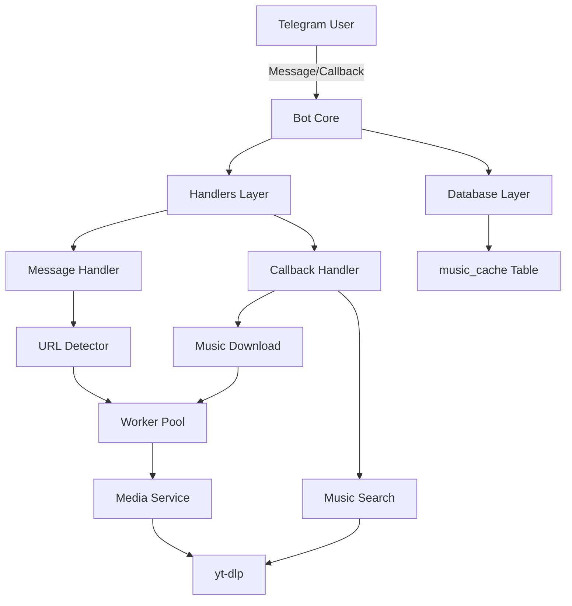
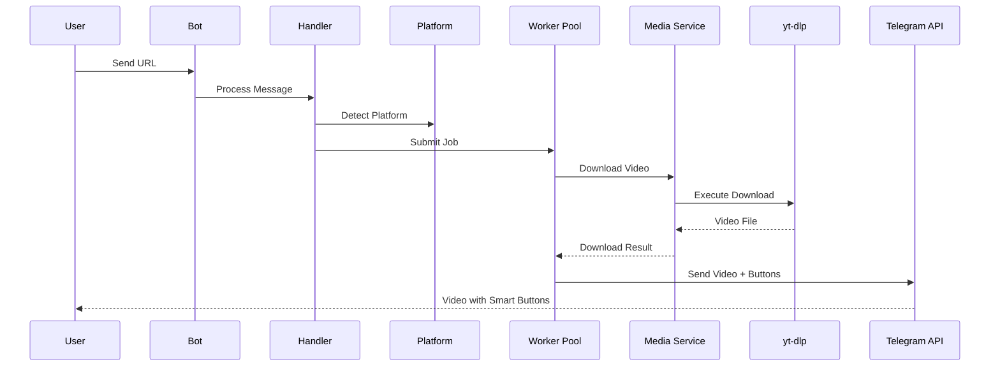
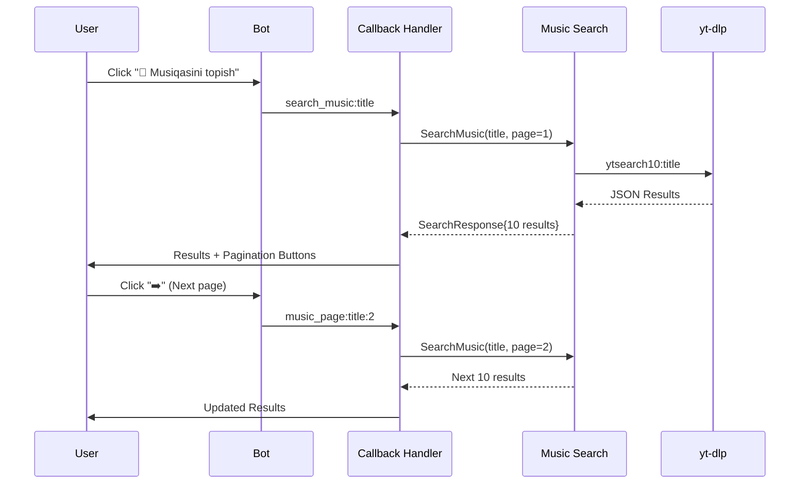
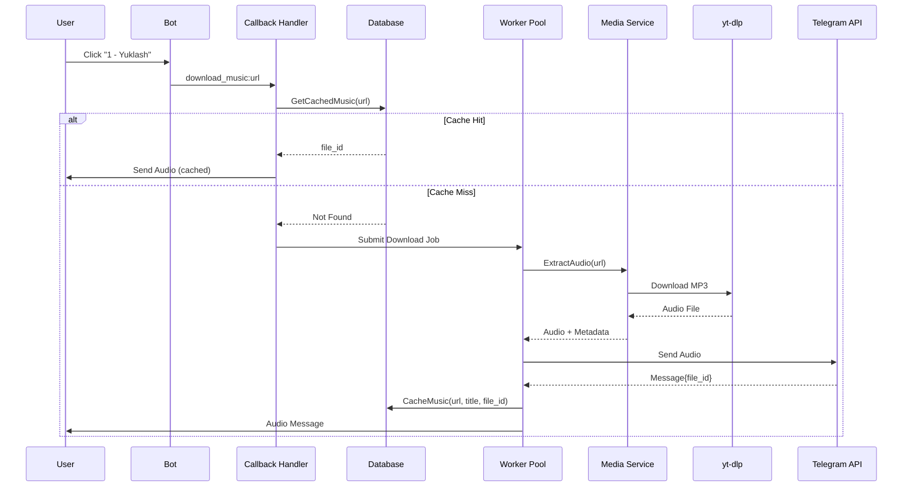

# InstaBot2 Architecture

## System Overview



## Component Breakdown

### 1. Bot Core (`internal/bot/bot.go`)
- Initializes Telegram Bot API connection
- Manages update routing
- Handles graceful shutdown
- Coordinates all components

### 2. Handlers Layer

#### Message Handler (`internal/bot/handlers.go`)
- **URL Detection**: Identifies and extracts URLs from messages
- **Platform Detection**: Determines source platform (IG, TT, YT, etc.)
- **Command Processing**: Handles `/start`, `/help` commands
- **Smart Buttons**: Creates inline keyboard with:
  - 🎵 Music Search button
  - ➕ Add to Group button

#### Callback Handler (`internal/bot/callback.go`)
- **Music Search Flow**: `search_music:title` → Search → Display results
- **Pagination**: `music_page:query:page` → Navigate results
- **Music Download**: `download_music:url` → Extract audio → Send
- **Close Action**: `close_music` → Delete results message

### 3. Music Module (`internal/music/search.go`)

**Search Flow:**
```
User Query → yt-dlp ytsearch10 → JSON Parse → UTF-8 Clean → Paginate → Return
```

**Features:**
- 10 results per page
- UTF-8 sanitization via `utils.SanitizeForTelegram()`
- HTML-safe formatting
- Duration extraction and formatting (MM:SS)

### 4. Media Service (`internal/services/media.go`)

**Video Download:**
```bash
yt-dlp -f best[ext=mp4]/best --print filepath --print title url
```

**Audio Extraction:**
```bash
yt-dlp -x --audio-format mp3 --audio-quality 0 --print filepath url
```

**Features:**
- Temporary file management
- Metadata extraction
- Auto-cleanup after send

### 5. Worker Pool (`internal/worker/worker.go`)

**Architecture:**
```
                [Job Queue Channel]
                        |
        +---------------+---------------+
        |               |               |
    Worker 1        Worker 2  ...   Worker 5
        |               |               |
    [Process]       [Process]       [Process]
```

**Implementation:**
- **Concurrency**: 5 goroutines (maxWorkers=5)
- **Queue**: Buffered channel (capacity 100)
- **Deduplication**: Active job tracking prevents duplicates
- **Graceful**: Uses sync.WaitGroup for coordination

### 6. Database Layer (`internal/database/db.go`)

**Schema:**
```sql
CREATE TABLE music_cache (
    id INTEGER PRIMARY KEY AUTOINCREMENT,
    query TEXT NOT NULL,           -- Search query
    title TEXT NOT NULL,           -- Track title
    file_id TEXT NOT NULL,         -- Telegram file_id
    duration INTEGER,              -- Track duration in seconds
    performer TEXT,                -- Artist name
    created_at DATETIME DEFAULT CURRENT_TIMESTAMP,
    UNIQUE(query, title)
);

-- Indexes for performance
CREATE INDEX idx_music_cache_query ON music_cache(query);
CREATE INDEX idx_music_cache_file_id ON music_cache(file_id);
```

**Caching Strategy:**
1. Check cache before download: `GetCachedMusic(query, title)`
2. If hit: Send via file_id (instant)
3. If miss: Download → Upload → Cache file_id
4. Future requests use cached file_id

### 7. Platform Support (`internal/downloader/platforms.go`)

**Supported Platforms:**
- Instagram: `instagram.com/`, `instagr.am/`
- TikTok: `tiktok.com/`, `vm.tiktok.com/`, `vt.tiktok.com/`
- YouTube: `youtube.com/`, `youtu.be/`, `youtube.com/shorts/`
- Pinterest: `pinterest.com/`, `pin.it/`
- Snapchat: `snapchat.com/`
- Likee: `likee.video/`, `like.video/`

### 8. Utilities (`internal/utils/sanitize.go`)

**UTF-8 Sanitization:**
```go
strings.Map(func(r rune) rune {
    // Keep safe characters
    // Replace problematic ones with space
})
```

**Features:**
- HTML entity unescaping
- Special character filtering
- Multi-space cleanup
- Length truncation (200 char limit)

## Data Flow Diagrams

### Video Download Flow


### Music Search Flow


### Music Download & Cache Flow


## Performance Considerations

### Concurrency
- **Worker Pool**: Limits concurrent downloads to 5
- **Non-blocking**: Bot responds to commands while downloads process
- **Goroutines**: Each update handled in separate goroutine

### Caching Benefits
- **Speed**: Cached audio sent in <1s (no download)
- **Bandwidth**: Reduces server load and bandwidth usage
- **Storage**: Only file_id stored (few bytes), no actual files

### Resource Management
- **Temp Files**: Auto-deleted after upload
- **Database**: SQLite for minimal overhead
- **Memory**: Streaming downloads, not loaded into memory

## Security Considerations

### Input Sanitization
- All user input sanitized via `SanitizeForTelegram()`
- URL validation before download
- Command injection prevention in yt-dlp calls

### Rate Limiting
- Worker pool naturally rate-limits downloads
- Per-job deduplication prevents spam

### Error Handling
- Panic recovery in update handlers
- User-friendly error messages
- Detailed logging for debugging

## Scalability Notes

### Current Limits
- **Workers**: 5 concurrent downloads
- **Queue**: 100 job buffer
- **Database**: SQLite (suitable for small-medium scale)

### Scaling Options
- Increase `maxWorkers` for more concurrency
- Replace SQLite with PostgreSQL/MySQL for larger scale
- Add Redis for distributed caching
- Deploy multiple bot instances with load balancer

## Future Enhancements

1. **Audio Quality Selection**: Let users choose bitrate
2. **Playlist Support**: Download entire YouTube playlists
3. **Custom Search Filters**: Duration, uploader, etc.
4. **Statistics Dashboard**: Track usage, popular downloads
5. **User Preferences**: Language, default quality, etc.
